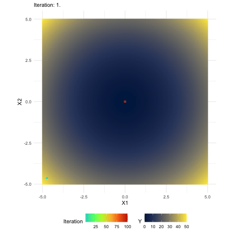

# Hons2025-Project
Honours Project Thesis Exploring Genetic Algorithms

This project contains a comparison of optimisation algorithms,
with a focus on Genetic Algorithms, with the goal to better understand 
how useful the 'evolution' metaphor is.

