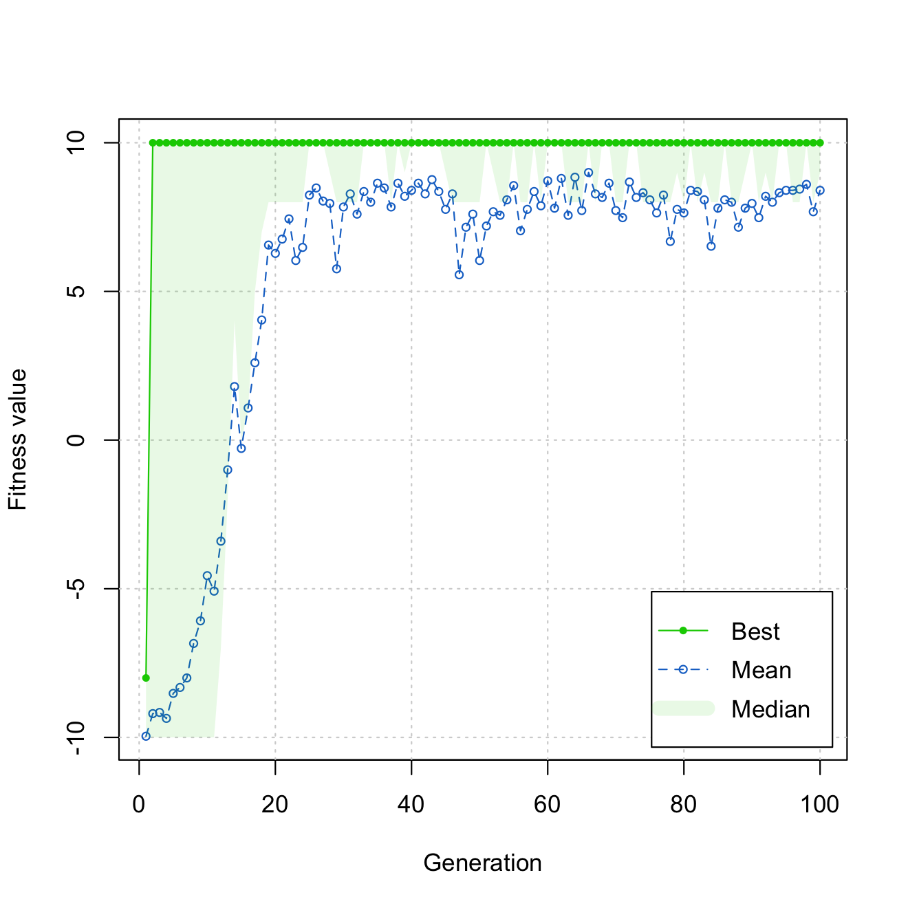

\tcbset{enhanced}

\newpage

# Introduction

# Literature Review

Optimisation can be thought of as a tool-selection problem. With different optimisation paradigms being the tools in your toolbox. A certain optimisation problem may be placed in front of you, the properties of which will inform which tools would suit the application. Each tool would have their unique set of tradeoffs --- you *could* use a sledgehammer to nail together a wooden frame, and using a ball-peen hammer to take down a wall is certainly... possible, though it clearly would be more exhausting to tackle each of those problems in such a way.

With optimisation, 'No Free Lunch' theorems inform us that finding an optimisation strategy that is suited to a certain problem is how we gain benefits between different optimisation paradigms --- "any elevated
performance over one class of problems is offset by performance over another class" [@wolpert1997].

It is typical that gradient methods perform better than function-value methods; with hessian methods performing even better. Although it is important to note that those methods do depend on being able to calculate or approximate gradients or hessians for the optimisation problem at hand.

For optimisation problems where hessians and gradients can be found, and where they are *useful* to optimisation algorithms (as opposed to being unstable to calculate, deceptive/misleading, or otherwise non-informative), the use of algorithms which can take advantage of them would be *expected* to be superior.

For those cases where usage of either gradients or hessians are impossible or otherwise unfeasible, function-value (or direct) methods are available. While this flexibility in which optimisation problems they can be applied to is beneficial, function-value methods losing the information available from gradients or hessians would either have no effect or a detrimental effect on an algorithm's performance in optimisation. I.e., it would not be useful to use such a method when ones better suited to a problem exist. For this reason function-value methods like genetic algorithms are most informatively compared with fellow function-value methods.

This paper will primarily discuss the difference between genetic algorithms and their closest competitors: derivative-free optimisation algorithms, or black-box methods.

# Methodology

## Design

### Update procedures

Where noted, a *strictly improving update procedure* will be used alongside the updating equations, defined as: $$\B x_{k+1} = \begin{cases}\B v_{k+1}&\text{if} \quad \op{f}{\B v_{k+1}}< \op{f}{\B x_k},\\\B x_k & \text{otherwise.}\end{cases}$$ Where $\B x_k$ is the best performing point at iteration $k$, and $\B v_{k+1}$ is the candidate point for the next iteration, $k+1$. This candidate point is generated by the **updating equation**.

Alternatively, the update procedure could be a simpler, *direct updating procedure*, where every updated point, $\B v_{k+1}$, is taken as the next iteration (thus the algorithm remains the same, but every $\B x_k$ in the above formula is replaced with $\B v_k$). No comparison with previous points is done. This would likely fit the deterministic algorithms better. The best solution at point $k$, $\B x_k$, is stored separately as a vector -- never accessed by the algorithm.

### Updating equations

At the core of this exploration of genetic algorithms and other methods for optimisation, are the *updating equations*. These define how each optimisation paradigm attempts to iteratively improve a candidate solution, $\B v$.

#### Hessian methods

Methods which utilise exact or approximate hessians.

##### Newton-Raphson

Calculates the hessian. $$\B x_{k+1} = \B v_k -\frac{f'\left(\B v_k\right)}{f''\left(\B v_k\right)}$$

#### Gradient methods

Methods which utlise exact or approximate gradients.

##### Gradient descent

$$\B v_{k+1} = \B v_k -\nu \nabla f\left( \B v_k \right),$$ where $\nu$ is the learning rate.

#### Function value methods

Also known as Direct Search, Pattern Search, or Black-Box Methods. These algorithms do not make use of gradient nor of hessian information. This makes them far easier to apply to any context.

##### Random search (RS)

The specific version of the random search algorithm is informed by the descriptions given in @zabinsky2011. Algorithms are described by being 'global' or 'local'.

**Pure Random Search (PRS)** repeatedly performs a global search with a simply improving update procedure.

The updating equation is defined as, $$\B v_{k+1} = \B u.$$

It is notable that neither of the terms $\B x_k$ nor $\B v_k$ -- the best or candidate points found by or for iteration $k$ -- are present in this formula.

Each generated point is *independent* of any previous point. The major benefit of this is PRS is 'embarrassingly parallelisable'. This is the only optimisation algorithm that will have this property in this paper.

We test also an additional variant of RS, where the global search is either performed solely for the starting point), $\B x_0$, or skipped entirely in favour of a user-defined starting point. Subsequent points are generated locally from the hypersphere (referred to as the '$\left(N-1\right)$-sphere', or 'surface of the $N$-ball') around $\B x_k$.

This is Rastrigin's **Fixed Step Size Random Search (FSSRS)**[@rastrigin1963].

An efficient way to sample uniformly from the surface of an $N$-ball is given by @marsaglia1972.

$$\B v_{k+1} = \B x_k +h \B u.$$

Here, $\B u$ is a normalised $N$-dimensional vector sample from the standard normal distribution such that,

$\B u = \frac1{\lVert \B z \rVert}\B z$ and $\B z \sim \mathcal{N}_N\left(0,1\right),$ and where $h$ is a step size hyperparameter.

##### Genetic algorithms

Genetic algorithms are a subset of evolutionary algorithms, typified by the use of three genetic operators: two-parent **crossover**, fitness-based **selection**, and random **mutation**.

*Real-coded* (in reference to $\mathbb R$, the real number set) genetic algorithms are used in this paper for greater applicability to arbitrary problems and models -- despite genetic processes occurring with a discrete set of genes (ACGT) in nature.

Notation does shift here, due to the genetic algorithm necessarily requiring multiple candidates for each iteration. Our previous notation referencing a single candidate per iteration is thus no longer feasible.

We are implementing genetic algorithms using the `GA` package, as described in @scrucca2013.

A brief explanation of the updating procedure follows.

###### **Fitness evaluation**

Fitness for each of the candidate solutions ('genotypes'), $\theta_i^{\left(k\right)}$ is calculated, where $i$ is an arbitrary index of the candidate solution in the generation $k$. This is typically the objective function of interest, $\op f{\cdot}$.

###### **Selection**

A subset of candidate solutions from the current generation's population becomes selected as a separate population known as the 'reproducing population'. Solutions are selected (with replacement) through a weighted selection process, based typically proportionally on the fitness of each genotype, $\op{f\!}{\theta_i^{\left(k\right)}}$, with probability $p_i^{\left(k\right)}$.

An elitist strategy can be used, which means that even if the best performers are unluckily not selected, an amount of them are still are pushed through to the next population. The default method for real-valued parameters is `gareal_lsSelection`: proportional selection with fitness linear scaling.

\begin{tcolorbox}[title=Selection with linear scaling: \texttt{gareal\_lsSelection()}]
Let $\B f$ contain the fitness values of each member in the current population.\\
\\
To ensure all fitness values are positive:
$$
\B f \leftarrow \begin{cases}
\B f- \op{min}{\B f} & \text{if } \op{min}{\B f} < 0,\\
\B f & \text{otherwise.}
\end{cases}
$$
Then, $\B f$ is scaled as follows.\\
\\
Let the mid-range, $M=\frac{\op{min}{\B f} +\op{max}{\B f}}2$.

$$
\begin{aligned}
\delta &=
\begin{cases}
\op{max}{\B f} - \bar f 
& \text{if } \bar f > M,
\\
\bar f -\op{min}{\B f} 
& \text{otherwise,}
\\
\end{cases}
\\
a&= 
\frac{\bar f}{\delta} \\
b&= 
\frac{\bar f}{\delta}\left(\delta - \bar f\right) = \bar f(1-\frac{\bar f}{\delta})
\end{aligned}
$$
$\B f' = a\B f + b$.\\
\\
Members of the population are then repeatedly sampled from, with probabilities proportional to their scaled fitness values, $\B f'$, where:
$$ p_i = \frac{f'_i}{\sum_j^Nf'_j}.$$

\end{tcolorbox}
Note that this is not the exact algorithm as contained within Scrucca's GA package. I have taken the liberty to simplify and rearrange terms for clarity of analysis. 

###### **Crossover**

The core of a genetic algorithm, the crossover operation, brings a means to generate additional 'child' (next generation) genotypes through parts of the 'genetic information' (parameter values) from either of the 'parent' (current generation) genotypes. Alongside mutation, crossover applied on the reproducing population creates the new, next generation population. By default, `gareal_laCrossover` is used, which is local arithmetic crossover.

\begin{tcolorbox}[title=Local arithmetic crossover: \texttt{gareal\_laCrossover()}]
Algorithm explanation:
\end{tcolorbox}

###### **Mutation**

The randomly shifting of the values of 'genes' (parameters) within genotypes. The probability of mutation can be set by the user. Alongside crossover, mutation applied on the reproducing population creates the new, next generation population. By default, `gareal_raMutation` is used, which is uniform random mutation.

\begin{tcolorbox}[title=Uniform random mutation: \texttt{gareal\_raMutation()}]
Algorithm explanation:
\end{tcolorbox}

Crossover and mutation operations increase diversity in a population, allowing us to explore more of the sample space (exploration), while selection operations decrease diversity in favour of increased fitness (exploitation).

## Analysis

Traces of each algorithm for 100 iterations on a 2-dimensional parabolic test surface.

Coloured dots show the progression of the best point found by each algorithm.

White crosses show each point checked by the algorithm.

Note that these traces are intended to be viewed as an animation. These are accessible in \href{https://github.com/m-yday/Hons2025-Project}{the Github repository for this project}.

{width="400"}

{width="400"}

{width="400"}

{width="400"}

#### Measuring Performance

An interesting issue with drawing comparisons between GAs and optimisation procedures is the issue of fairly assessing the amount of function calls. We could simply compare the iteration number like we have with the other optimisation procedures. We would have to note how some procedures require more overhead for each function call, but until now, these overheads above the function call were not too excessive. Now with GAs, we have an entire population being assessed with each iteration. The GA package (Scrucca 2017) uses a default population size of 50, and throws a warning if the population size is less than 10. 

A solution to this is taking the product of the iteration number and population size to get a value of function calls completed by the process. This does seem to be the fairest assessment method. When attempting this, we might use the iteration limit of 100 that we have currently been using, and divide that by the population size being used.

Whoops. Using the default value, we've reached our maximum amount of function calls in two population iterations.

Clearly, we have not given GAs a fair chance to flex their muscles. There has barely been enough time for any of the 'learning' that GAs are capable of to come through in a single step.

So perhaps we try a more balanced value: 10 iterations of population size 10. 

Ah phooey. We now have the issue of rarer events like mutation $\left(p=0.1\right)$ only occurring once on average per population step. Additionally, 10 population steps is still squeezing the algorithm quite a bit. This seems hardly fair. Random search will have trouble making any meaningful progress towards a solution if it was given 10 iterations. Even gradient methods would have the issue of having suboptimal results with 10 iterations. Therefore, this is clearly not an issue that lands solely with direct search methods.

Perhaps we could consider _unique_ function calls. This may be a better fit. GAs do have a tendency to repeatedly check the same values. Well-performing genes will survive to the next generation, to be tested again. Crossover does complicate this, but it should be clear that in principle, the probability of collisions is increased through this form of performance sampling. Though this does diminish quickly as the dimensions of the search increase. 

{width="400"}

Wow! Clearly GAs do a pretty fine job. In just 2 population steps we had already had at least one full set of 10 drones successfully completing the course. 
Additionally by iteration 25, even the mean score of the drones is comfortably sitting at ~8. Noting that minimum score possible is -10, and maximum is 10, that means we consistently have 9/10 drones completing the course. 

So why have I been so negative toward GA, when its performance looks so promising? 

Well, let's consider some things that these graphs are not showing.
2 steps means between 51-100 function calls, the GA was able to eventually gain its first completely successful run. This is not completely bogus, it's a very fair result from a direct search algorithm. This is a comfortable position to be in relation to RS.

This took approximately $xyz$ seconds to run. In comparison, a local random search algorithm takes $zyx$ seconds. This is a $abc$-fold increase over other methods.
When we compare the performance of the RS training of the neural network, we find that: 

Even if we stop the training after 25 population iterations, that is still 1250 function calls.

# Results

# Conclusion

<!--## Areas for extension

aka, how i don't go down too many rabbit holes while working on this

 Testing additional random search algorithms: - Luus–Jaakola (LJ) - Improving Hit-and-Run (IHR) - Simulated Annealing

Testing against Travelling Salesman Problem (or problems where the search space grows rapidly)

mention: metaheuristics converging iterative / single step / (what word was it) optimisation

Show probability of collisions with GAs (crossover) -->

\newpage

# Bibliography
